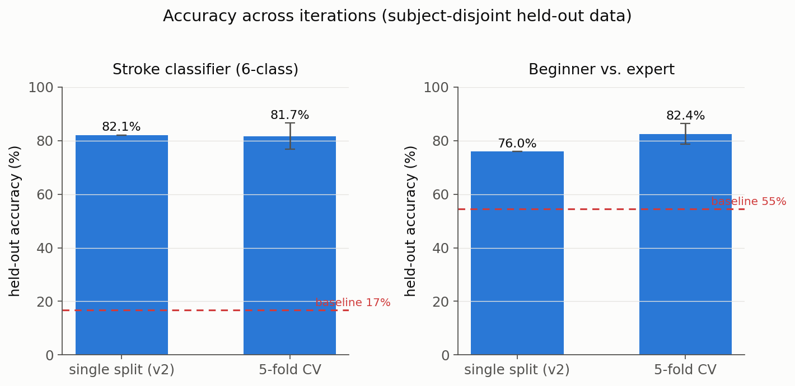
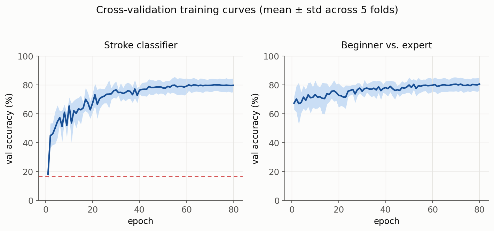

# SkillEye

Motion-quality analysis for racket-sport swings (forehand / backhand / volley / serve / smash).
Built for the 8th CTCI Science and Technology Creativity Competition 2026 (Sports theme).

**Pipeline**: video → RTMPose (2D skeleton extraction) → ST-GCN (spatio-temporal modeling) →
stroke classification, with the same skeleton representation intended to support per-joint/phase
motion-quality scoring and rule-based correction suggestions. Positions against ball-tracking
apps (e.g. SwingVision) by focusing on movement quality rather than match outcome.

## Results (THETIS dataset, full run)

Reported as **5-fold, subject-disjoint cross-validation** (mean ± std) — not a single lucky
split. 55 subjects total; each fold trains on ~44 and validates on the other ~11, held out
entirely (no subject appears in both train and validation).

- **Skeleton extraction**: 1,980/1,980 clips processed, 0 dropped, 0 failed, across all 12
  THETIS action categories and 55 subjects.
- **Stroke-type classifier (ST-GCN)**: **81.7% ± 4.9%** held-out accuracy, 6 classes
  (backhand / forehand / backhand_volley / forehand_volley / serve / smash), vs. a 16.7%
  majority-class baseline.
- **Beginner-vs-expert classifier (ST-GCN)**: **82.4% ± 3.8%** held-out accuracy distinguishing
  THETIS's beginner/expert-labeled subjects from raw skeleton motion alone, vs. a 54.6%
  majority-class baseline.



<table>
<tr>
<td></td>
<td></td>
</tr>
</table>



Full write-up with per-class precision/recall, the reasoning behind each design change across
iterations, and what the confusion matrices actually mean for the project (e.g. why the volley
classes are hardest, and what that implies for camera placement):
[`results/RESULTS_SUMMARY.md`](results/RESULTS_SUMMARY.md).

## Repo layout

```
skilleye/           pipeline code
  skeleton_pipeline.py       RTMPose output -> single tracked subject -> normalized skeleton
  batch_extract.py           CLI batch runner over a THETIS-shaped folder tree (resumable)
  stroke_dataset.py          THETIS category merging, subject-disjoint/k-fold splitting
  stgcn_model.py             compact ST-GCN (COCO-17 skeleton graph)
  train_stroke_classifier.py      stroke classifier, single split (v2: 6 classes, augmented)
  train_beginner_expert_stgcn.py  beginner/expert ST-GCN, single split (v2)
  cross_validate.py          5-fold cross-validation for both classifiers (v3)
  generate_figures.py        renders results/figures/*.png from the metrics JSONs
  beginner_expert_check.py   beginner/expert hand-crafted-feature sanity check (v1)
  requirements.txt
  README.md                  environment setup notes (incl. GPU-specific gotchas)

results/
  RESULTS_SUMMARY.md         full technical write-up (v1, v2, v3)
  figures/                   PNGs embedded above, regenerate with generate_figures.py
  cross_validation/                 v3: 5-fold CV, per-fold + aggregated metrics
  beginner_expert_check.json        v1: hand-crafted features + logistic regression
  beginner_expert_stgcn/            v2: ST-GCN, single split, trained weights + metrics
  stroke_classifier/                v1: 5-class, trained weights + metrics
  stroke_classifier_v2/             v2: 6-class + augmentation, trained weights + metrics
```

## Dataset

Uses [THETIS](https://github.com/THETIS-dataset/dataset) (`VIDEO_RGB` + `papers` only — not
included in this repo, see `skilleye/README.md` for how to fetch it). THETIS's near-frontal,
17-19fps camera is sufficient for stroke classification and pretraining but not for the
biomechanical joint-angle rules the final quality-score model needs — own side-view/60fps
recordings are planned for that stage.
