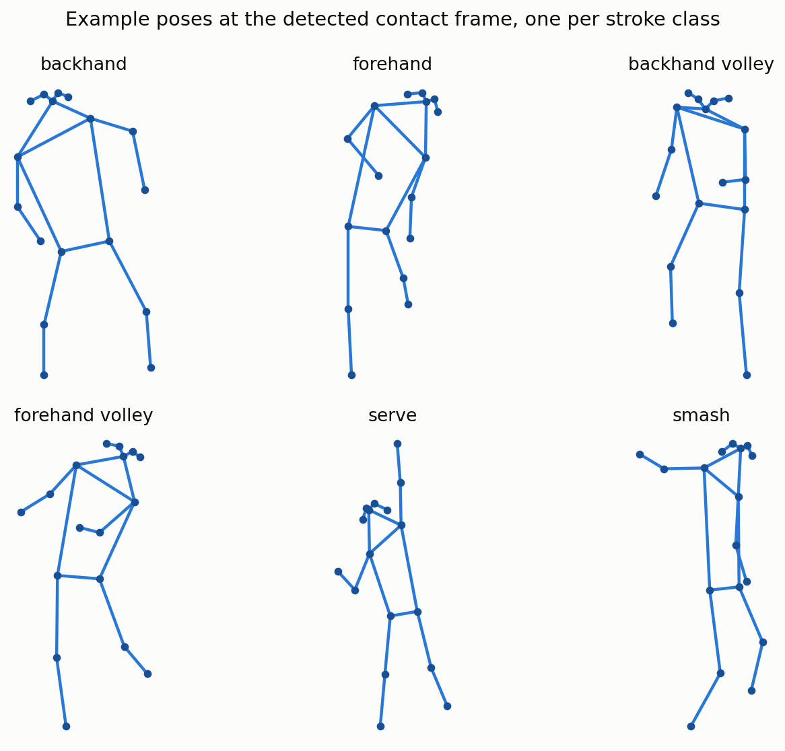
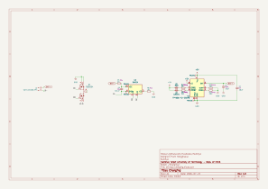
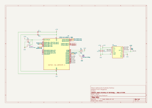
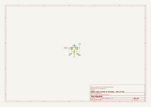
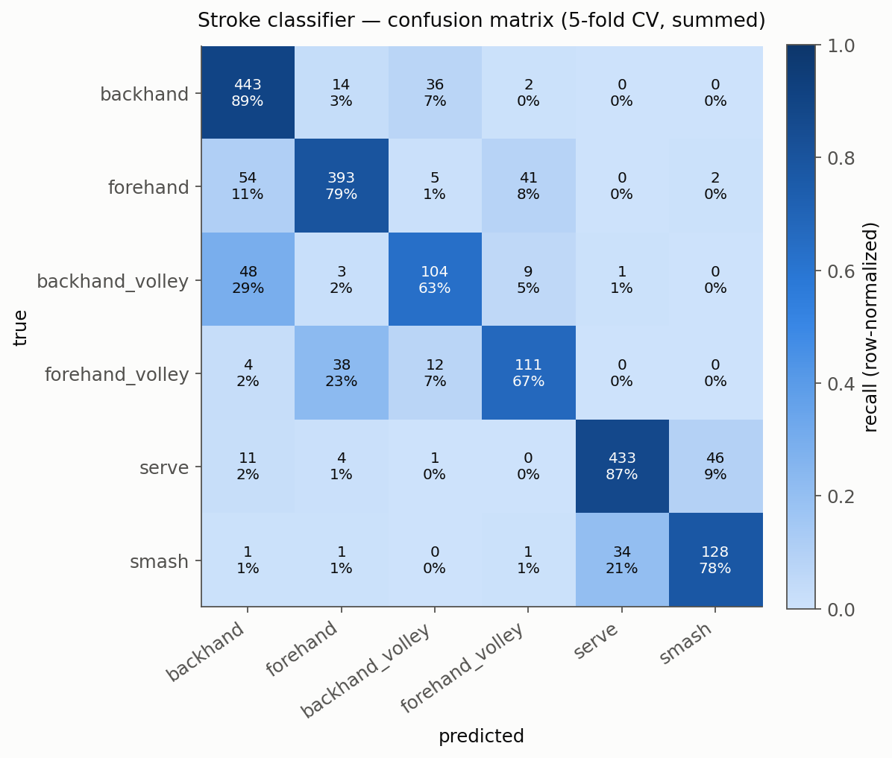
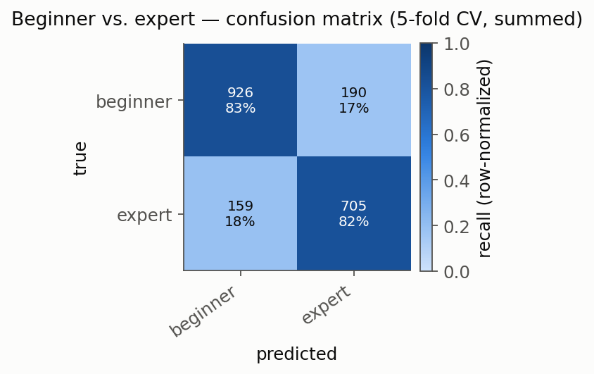
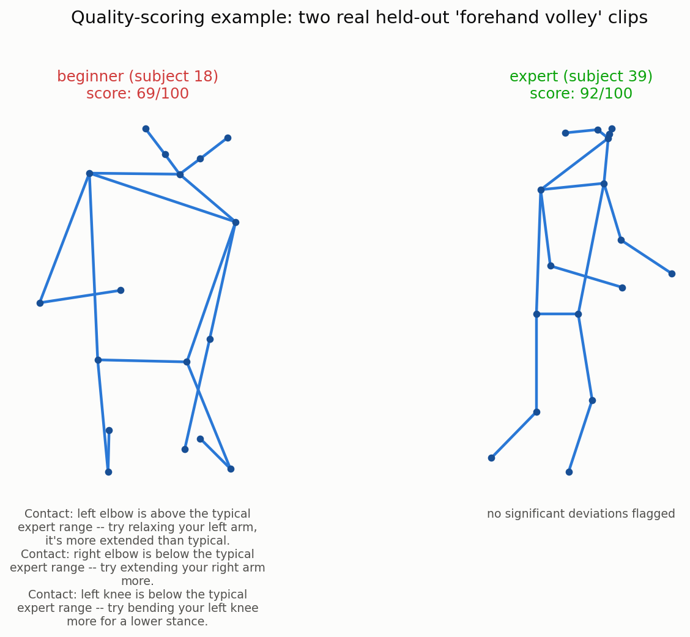

# SkillEye: Skeleton-Based Motion Quality Analysis for Racket Sports

Submission for the 8th CTCI Science and Technology Creativity Competition 2026 (Sports theme).

## Abstract

Existing racket-sport analytics apps (e.g. SwingVision) center on ball tracking and match
outcome — where the ball landed, who won the point. SkillEye instead analyzes the player's
*movement*, extracting a normalized 2D skeleton from swing video with RTMPose and modeling it
with a Spatio-Temporal Graph Convolutional Network (ST-GCN), toward the goal of a per-swing
motion-quality score with joint/phase-level error detection and rule-based correction feedback.
This addresses both the "training methods" and "injury prevention" sub-themes of the
competition through one shared representation.

This document reports the technical work completed to date on the [THETIS](https://github.com/THETIS-dataset/dataset)
tennis dataset: a validated pose-extraction pipeline (1,980/1,980 clips, 0 failures), a 6-class
stroke-type classifier (**81.7% ± 4.9%**, 5-fold subject-disjoint cross-validation), and a
beginner-vs-expert motion-quality proxy classifier (**82.4% ± 3.8%**). Both are real trained
results on held-out subjects, not projected targets. A rule-based v1 of that quality-score
system — phase detection, per-joint deviation from expert-clip templates, and generated
correction suggestions — is implemented and demonstrated through an accompanying Streamlit UI.
Section 4 discusses what these results do and do not establish, and Section 5 lays out the
remaining work toward the full quality-score system.

## 1. Introduction

### 1.1 Motivation

Amateur and intermediate racket-sport players typically improve technique through in-person
coaching, which is expensive, geographically limited, and infrequent relative to how often
players practice alone. Video-based swing analysis could close this gap, but existing consumer
tools (SwingVision and similar) are built around ball-tracking and scorekeeping — they answer
"did the shot land in" rather than "what did the player's body do." Movement quality is the
input a coach actually reasons about (elbow position at contact, hip rotation timing, follow-through),
and it is not derivable from ball trajectory alone.

### 1.2 Related Work

The technical approach follows two established lines of work rather than proposing new
architectures: **RTMPose** for real-time 2D human pose estimation, and **ST-GCN**
(Yan, Xiong & Lin, 2018) for skeleton-based action recognition, which models a keypoint sequence
as a spatio-temporal graph — spatial edges follow the human skeleton, temporal edges connect the
same joint across frames. The novelty in SkillEye is the application: using this representation
not just to classify *what* stroke was performed (a mature task), but as the foundation for
scoring *how well* it was performed, which is comparatively unexplored for racket sports at
consumer scale. The THETIS dataset itself (Gourgari et al., CVPR 2013 workshop) was built for
action recognition, not quality assessment — Section 2.1 and 4.1 discuss what that means for
how it can and cannot be used here.

A useful point of comparison is Wagner's tennis serve dataset (2024, [jasnwag/tennis_serve_dataset](https://github.com/jasnwag/tennis_serve_dataset)),
which takes a near-opposite set of trade-offs to THETIS: broadcast footage of the 2024 US Open,
109 professional players, 5,966 serves, with **3D** pose (RTMPose → MotionBERT lifting →
DTW-aligned) rather than 2D, and — notably — an actual serve-quality classification task
(84.0% reported), where THETIS offers only the subject-level beginner/expert proxy used in
Section 2.4/3.2. Table 2 summarizes the contrast:

**Table 2.** Dataset comparison.

| | THETIS (this work) | Wagner tennis serve dataset |
|---|---|---|
| Source | controlled gym recording (Kinect) | broadcast video, 2024 US Open |
| Camera angle | near-frontal | broadcast (side/elevated) |
| Pose dimensionality | 2D (COCO-17) | 3D (COCO-17, MotionBERT-lifted) |
| Subjects | 55 (31 beginner, 24 expert) | 109 professional players |
| Stroke coverage | 12 categories, all strokes | serves only |
| Clips | 1,980 | 5,966 serves |
| Quality ground truth | none (subject-level skill label only) | serve-quality labels available |
| License | dataset's own terms | CC BY 4.0 |

The two datasets are complementary rather than substitutable for this project: THETIS's frontal
angle and 2D pose match what a consumer phone camera can realistically capture (the deployment
target), while the serve dataset's 3D pose and side/elevated broadcast angle are closer to what
the biomechanical joint-angle rules in Section 4.7 of the proposal actually need, and its
existing quality labels are exactly the kind of ground truth Path A/B (Section 5) is trying to
establish independently. It is treated here as a comparative reference and a candidate source
for cross-dataset validation once the 2D pipeline has a 3D-compatible variant, not (yet) as
training or evaluation data for the models in Section 3 — see Section 5 for that as a concrete
next step.

### 1.3 Contributions

1. A validated, resumable pose-extraction pipeline from raw racket-sport video to normalized,
   tracked, single-subject skeleton sequences (Section 2.2).
2. A stroke-type classifier trained from scratch on the extracted skeletons, evaluated with
   5-fold subject-disjoint cross-validation rather than a single split (Section 3.1).
3. Evidence, from a dedicated experiment, that motion *quality* (not just stroke type) is
   learnable from this same skeleton representation — using THETIS's beginner/expert metadata
   as a weak proxy label ahead of real coach-rating ground truth (Section 3.2).
4. An honest accounting of what this dataset cannot yet support (Section 4.1) and a concrete
   plan for closing that gap (Section 5).

## 2. Methodology

### 2.1 Dataset

[THETIS](https://github.com/THETIS-dataset/dataset) (Gourgari et al., 2013) provides 1,980 RGB
video clips across 12 tennis action categories, performed by 55 subjects (**p1–p31 labeled
beginner, p32–p55 labeled expert** per the dataset's own metadata), recorded at ~17–19 fps,
640×480, with a Kinect camera facing the subject (near-frontal, not side-on). Only the
`VIDEO_RGB` subset is used — `VIDEO_Skelet2D/3D` uses Kinect's joint definition (not COCO-17,
the format the deployed pipeline actually produces) and covers only 1,217 of 8,374 sequences,
so it would not be representative even if remapped.

Class composition after the merge described in 2.3 (Table 1):

| stroke | THETIS sub-categories merged | clips |
|---|---|---:|
| backhand | backhand, backhand2hands, backhand_slice | 495 |
| forehand | forehand_flat, forehand_openstands, forehand_slice | 495 |
| backhand_volley | backhand_volley | 165 |
| forehand_volley | forehand_volley | 165 |
| serve | flat_service, kick_service, slice_service | 495 |
| smash | smash | 165 |
| **total** | | **1,980** |

By skill label: 1,116 clips from 31 beginner subjects, 864 clips from 24 expert subjects.

**Measured limitations relevant to this project** (checked directly on sample frames, not
assumed from the dataset paper): the ~17-19fps frame rate is below what the proposal's
biomechanical rules assume is needed to resolve fast strokes (e.g. serves), and the
near-frontal camera angle does not capture the side-on view that joint-angle-based
error-detection rules require. THETIS is therefore treated here as suitable for pretraining the
motion representation and for stroke/skill classification (both established, well-precedented
tasks — this is what Sections 2.3–2.4 and 3 use it for), but **not** as a substitute for
purpose-collected side-view footage when the actual per-swing quality-score model is built
(Section 5).

### 2.2 Pose Extraction Pipeline

Each clip is processed frame-by-frame with **RTMPose** (`rtmpose-s_simcc-body7`, lightweight
mode, COCO-17 keypoints) for pose estimation and **YOLOX-tiny** for person detection, both run
via `rtmlib`/ONNX Runtime. Frames may contain more than one person (other players/staff visible
in the gym), so a dedicated tracking step selects a single, temporally consistent subject:

1. **Primary-subject selection** — on the first frame, the person with the largest visible
   bounding box (among detections with ≥3 confidently-visible joints) is chosen as the subject.
   On subsequent frames, the detection with the nearest hip-center to the previous frame's
   selection is kept, which prevents identity swaps between the subject and any other person
   entering the frame (largest-bbox alone is insufficient once multiple people are present).
2. **Confidence-based interpolation** — per joint, frames below a 0.3 confidence threshold are
   linearly interpolated from the nearest confident frames on either side (no extrapolation at
   clip boundaries). Clips where the primary subject is confidently visible in under 50% of
   frames are dropped rather than interpolated across too large a gap.
3. **Normalization** — each frame is re-centered on the hip midpoint and scaled by
   shoulder-to-hip (torso) length, so the model learns the *shape* of the motion rather than the
   subject's distance from or position relative to the camera.

Result: **1,980/1,980 clips extracted successfully, 0 dropped, 0 failed**, ~1.4s/clip. Code:
`ml/skilleye/skeleton_pipeline.py` (steps above), `ml/skilleye/batch_extract.py` (CLI batch runner,
resumable — skips clips that already have output on disk, so an interrupted run can restart
without redoing completed work).

### 2.3 Stroke Classification Model

THETIS's 12 action categories are merged into 6 target classes (Table 1) reflecting the strokes
the proposal is actually built around — `serve` merges the three service sub-types (genuinely
one stroke with different spin), but `forehand_volley` and `backhand_volley` are kept **separate**
rather than merged into a single "volley" class, since they are visually and kinematically
distinct motions (an earlier iteration that merged them made that class disproportionately hard
to classify — see Section 4.1).

**Architecture**: a compact ST-GCN — 6 spatio-temporal blocks operating on the COCO-17 skeleton
graph (symmetric-normalized adjacency, self-loops included), channel widths 32→64→128→256,
global average pooling, linear classification head. Input is a 4-channel tensor per joint per
frame: 2D position plus its temporal finite-difference (velocity), giving the model direct
access to motion speed/direction rather than only inferring it across pooled layers. Each clip
is time-resampled to a fixed 64 frames (linear interpolation) so variable clip lengths (THETIS
clips range from roughly 2 to 8+ seconds) can be batched. Code: `ml/skilleye/stgcn_model.py`.

**Training**: Adam (lr 1e-3, weight decay 1e-4), cosine-annealed learning rate, class-weighted
cross-entropy (classes are imbalanced — see Table 1), 80–100 epochs, batch size 32. With only 55
subjects total, label-preserving data augmentation is applied at train time: left-right mirroring
(negate the x-coordinate and swap left/right joint indices — a mirrored forehand is still a
forehand, just as a left-handed player's would look), random temporal cropping (retain a random
85–100%-length contiguous sub-window before resampling), and small Gaussian coordinate jitter
(σ=0.02, in normalized units). Code: `ml/skilleye/train_stroke_classifier.py`.

### 2.4 Beginner-vs-Expert Motion-Quality Proxy Model

To test whether motion *quality* — not just stroke identity — is learnable from this
representation, a second model is trained on THETIS's beginner/expert subject-level label
(Section 2.1) as a weak proxy for swing quality, ahead of collecting real coach ratings
(Section 5). Two approaches were tried, reported both for transparency:

- **v1 — hand-crafted features + logistic regression** (`ml/skilleye/beginner_expert_check.py`):
  9 interpretable per-clip features (mean/std swing speed, jerk, elbow/knee joint-angle
  variance, wrist extension range) fed into a linear classifier.
- **v2 — ST-GCN** (`ml/skilleye/train_beginner_expert_stgcn.py`): identical architecture and
  augmentation to Section 2.3, but with a binary beginner/expert output head, trained directly
  on the raw skeleton sequence rather than hand-summarized statistics.

### 2.5 Evaluation Protocol

All splits are **subject-disjoint**: no subject's clips appear in both the training and
validation sets. THETIS clips from the same subject are highly correlated (same body, same
camera, same session), so a clip-level random split would leak subject identity into validation
and overstate accuracy — the model would partly be recognizing *people*, not strokes or skill.

Headline numbers use **5-fold subject-disjoint cross-validation** (`ml/skilleye/cross_validate.py`):
subjects are split into 5 folds, stratified so each fold's held-out group keeps a
beginner/expert mix; each fold trains a fresh model on the other 4 folds' subjects (~44) and
evaluates on the held-out fold's subjects (~11). This is reported as **mean ± standard
deviation across folds**, rather than a single split's number, because with only 55 subjects a
single split's held-out accuracy depends materially on *which* subjects happened to be held
out — the fold-to-fold spread reported in Section 3 is itself informative about that variance.

### 2.6 Quality Scoring System

The proposal's central promised feature -- a per-swing motion-quality score with
per-joint/phase error detection and rule-based correction suggestions (Section 4.7) -- is
implemented here as a rule-based comparison against expert-clip statistics, not a learned
regression model. No coach-rating ground truth exists yet (Path A/B, Section 5), so a
supervised quality-score model cannot be trained honestly; this is an explicitly-scoped
interim v1, in the same spirit as the v1->v2->v3 iterations already described for the
classifiers above.



**Phase detection** (`ml/skilleye/quality/phases.py`): each clip's dominant wrist (whichever
moves more overall -- a proxy for the hitting arm, since THETIS doesn't label handedness)
is used to find the contact frame (peak wrist speed, a standard swing-analysis heuristic),
splitting the clip into three phases: backswing, a short window around contact, and
follow-through.

**Joint angles** (`ml/skilleye/quality/angles.py`): per phase, four flexion angles
(left/right elbow, left/right knee) plus a trunk-rotation proxy (shoulder-line vs.
hip-line angle) are averaged into one scalar per (phase, joint).

**Expert templates** (`ml/skilleye/build_expert_templates.py`, run once offline): for each
stroke class, the mean and standard deviation of each (phase, joint) scalar across that
class's expert-labeled clips, computed only from the training side of this project's
standard subject-disjoint split (Section 2.5) -- never from the held-out validation
subjects, which remain available as genuinely unseen demo inputs.

**Scoring** (`ml/skilleye/quality/score.py`): a query clip's (phase, joint) scalars are
z-scored against its predicted stroke's template; |z| > 1.5 is flagged and mapped to a
fixed coaching-tip sentence, and the overall 0-100 score is a monotonic function of mean
absolute deviation. `SCORE_SCALE`/`FLAG_THRESHOLD` are sanity-checked (Section 3.3), not
formally calibrated -- that calibration is exactly what Path A/B ground truth would
enable.

**Demo UI** (`ml/skilleye/app.py`, Streamlit): pick a stroke category and a sample clip
(restricted to the held-out validation subjects, so every demo score is computed against
a template that never saw that subject) and see the skeleton, the existing stroke
classifier's prediction, the quality score, the per-phase/joint table, and the correction
suggestions together. Run with `streamlit run app.py` from `ml/skilleye/`.

**AI-generated explanation (optional)**: a "Generate AI explanation" button in the demo
UI rewrites the already-flagged deviations above into one natural coaching paragraph via
an LLM (NVIDIA's build.nvidia.com API). The LLM is only ever given the (phase, joint,
z-score) rows the rule-based system already flagged — it never inspects raw angles or
introduces a new diagnosis — so this is a communication layer over the existing,
smoke-checked scoring system, not a new source of truth. It requires an `NVIDIA_API_KEY`
environment variable; without one (or if the API call fails for any reason), the button
falls back to a short warning and the rule-based suggestions list above remains the
result, so the demo never depends on network access to function. Design:
`docs/superpowers/specs/2026-07-23-llm-correction-explainer-design.md`.

### 2.7 Sensor-Fusion Extension (Prototype)

A team discussion identified a concrete limitation already described in Section 4.1: a
single frontal 2D camera cannot see racket-face angle or wrist-snap dynamics at contact —
exactly the kind of high-frequency, off-camera-plane signal a racket-mounted IMU
(accelerometer + gyroscope) would capture directly. This section covers both halves of
that work: the hardware (designed by a teammate, in parallel with everything else in this
document) and the software fusion prototype that will eventually consume its data.

**Hardware — rev1.0 schematics** (designed by [@kyriosaa](https://github.com/kyriosaa)):
an ESP32-C6-WROOM-1 microcontroller paired with an ST LSM6DSO 6-axis IMU
(accelerometer + gyroscope) for sensing, a TP4056/DW01A/FS8205A single-cell Li-ion
charging and protection circuit, and an HT7833 regulator for the board's 3.3V rail.
Full KiCad project: `hardware/skilleye_prototype/` (schematics, PCB layout, component
libraries, datasheets); rendered schematic sheets below, source at
`docs/schematics/prototype/rev1.0/`.

| Charging | MCU + IMU | Regulator |
|---|---|---|
|  |  |  |

This is schematic-complete design work, not yet a built board: no physical prototype has
been assembled, no firmware has been written, and no real sensor data has been collected.
The modeling work below is written accordingly — it does not depend on or wait for the
physical board, and does not claim to have used it.

**Software architecture** (`ml/skilleye/imu_fusion.py`): `STGCN` is refactored to expose
its pooled pre-classifier features via `extract_features()` (`ml/skilleye/stgcn_model.py`,
backward compatible — every existing caller is unaffected). A small `IMUEncoder` (1D-CNN
over a 6-channel accelerometer+gyroscope stream) is fused with that skeleton branch via
concatenation before one classification head (`FusedBeginnerExpertModel`), targeting the
beginner/expert distinction specifically, since that is the axis this sensor is meant to
inform.

**Synthetic data, stated plainly**: because no real sensor data exists yet,
`synthetic_imu_from_skeleton()` derives a placeholder signal from the skeleton itself
(wrist acceleration, forearm angular velocity) rather than from a real sensor. This signal
is, by construction, redundant with information the skeleton branch already has access to
— so `train_beginner_expert_fusion_prototype.py`'s output is a demonstration that the
fusion architecture and training loop work end to end, **not an accuracy result**, and its
numbers must not be cited alongside Section 3.2's cross-validated 82.4% ± 3.8%.

**Path to real data**: a documented collection protocol (~100-200 Hz logging, a tap-based
manual sync event between the video and IMU streams, resampled to the same fixed frame
count skeletons already use) is in
`docs/superpowers/specs/2026-07-23-imu-fusion-prototype-design.md` — written before the
rev1.0 schematic existed, so it describes a generic MPU6050+ESP32 pairing rather than the
LSM6DSO+ESP32-C6 above; the collection method (sampling rate, sync approach) still applies
unchanged. Swapping `synthetic_imu_from_skeleton()`'s call site for a real-data loader is
the only code change needed once the board above is built and recordings exist.

## 3. Results

### 3.1 Stroke Classification

**81.7% ± 4.9%** held-out accuracy (6-way; majority-class baseline 16.7%), fold range
72.5%–86.1%.




| class | precision | recall | f1 | support |
|---|---:|---:|---:|---:|
| backhand | 0.79 | 0.90 | 0.84 | 495 |
| forehand | 0.87 | 0.79 | 0.83 | 495 |
| backhand_volley | 0.66 | 0.63 | 0.64 | 165 |
| forehand_volley | 0.68 | 0.67 | 0.68 | 165 |
| serve | 0.93 | 0.88 | 0.90 | 495 |
| smash | 0.73 | 0.78 | 0.75 | 165 |

`serve` is the strongest class — mechanically the most distinct motion (toss + overhead
strike). The volley classes are weakest, and the confusion matrix shows *why*: forehand_volley
is confused primarily with forehand, backhand_volley primarily with backhand — i.e. a volley
shares arm-swing kinematics with its groundstroke counterpart, and the near-frontal 2D camera
does not capture the footwork/court-position difference (volleys are played closer to the net)
that would otherwise disambiguate them. This is discussed further in Section 4.1.


### 3.2 Beginner vs. Expert

**82.4% ± 3.8%** held-out accuracy (2-way; majority-class baseline 54.6%), fold range
78.5%–89.7%. The v1→v2 progression:

| iteration | method | held-out accuracy |
|---|---|---|
| v1 | 9 hand-crafted features + logistic regression, single split | 58.6% (baseline 54.6%) |
| v2 | ST-GCN on raw skeleton sequence, single split | 76.0% |
| **v3** | **ST-GCN, 5-fold cross-validation** | **82.4% ± 3.8%** |



v1 established that *population-level* differences between beginner and expert clips are real
and highly significant (Welch's t-test on all 9 features, p<0.02, most p<1e-10, n=1,980) —
notably, **experts showed higher swing speed, jerk, and joint-angle variance than beginners, not
lower**, i.e. expert swings read as more dynamic/forceful rather than smoother in this dataset,
which should inform how a smoothness-based quality heuristic is weighted. But v1's linear model
on those 9 summary statistics only reached 58.6% held-out accuracy — barely above baseline,
meaning the signal existed in aggregate but wasn't usable per-subject with simple features.

v2 replaced the hand-crafted features with the same ST-GCN architecture used for stroke
classification, trained directly on the raw skeleton sequence, and reached 76.0% on a single
split. v3 cross-validated that result and found it was, if anything, an *unfavorable* split —
the cross-validated mean (82.4%) is higher than the single-split number, with folds ranging
78.5%–89.7% (Table above; per-class breakdown: beginner precision 0.85/recall 0.83, expert
precision 0.79/recall 0.82, summed over all 5 folds' held-out predictions).

### 3.3 Quality Scoring Smoke Check

No formal ground truth exists yet to validate quality scores against (Section 2.6) --
this instead checks the one directional claim the system must satisfy to be credible:
held-out expert clips should score higher on average than held-out beginner clips, per
stroke class, against that stroke's own expert template.

| stroke | expert mean | beginner mean | experts higher? |
|---|---:|---:|---|
| backhand | 89.8 | 86.2 | yes |
| backhand_volley | 90.9 | 84.6 | yes |
| forehand | 90.1 | 86.6 | yes |
| forehand_volley | 88.9 | 77.5 | yes |
| serve | 87.6 | 87.0 | yes |
| smash | 87.9 | 87.1 | yes |

Experts scored higher on every stroke with held-out data (`ml/skilleye/smoke_check_quality_scoring.py`).
This is a sanity check, not a validation -- it confirms the scoring system's direction
is sane on the same subject-level proxy label used in Section 3.2, not that its absolute
scores or flagged joints are correct at the level of a real coach's judgment. That
remains gated on Path A/B ground truth (Section 5).

The aggregate numbers above are a directional average -- the actual per-clip output looks
like this (two real held-out `forehand_volley` clips, the largest expert/beginner gap in
the table above):



The beginner clip's flagged joints are concrete and actionable (left elbow over-extended,
right elbow under-extended, left knee not bent enough at contact) rather than an opaque
number -- this is what "rule-based correction suggestions" (proposal Section 4.7) actually
produces today, not a mockup of what it might eventually say.

## 4. Discussion

### 4.1 Limitations

- **Camera geometry limits stroke disambiguation.** The volley/groundstroke confusion in
  Section 3.1 is a direct consequence of THETIS's near-frontal camera — footwork and
  court-position cues that would resolve it are not visible from that angle. Side-view footage
  (planned, Section 5) should address this directly, not just improve accuracy but make the
  representation richer for the eventual per-phase error detection this project needs.
- **The beginner/expert label is a subject-level proxy, not a per-swing quality score.** THETIS
  labels an entire subject as beginner or expert; it says nothing about whether a specific swing
  within that subject's clips was a particularly good or bad execution. The precision/recall
  asymmetry noted in Section 3.2 (the model calls some beginner clips "expert" and vice versa)
  is consistent with this — a beginner's better attempts plausibly look expert-ish in isolation,
  and the reverse. Section 3.2's result demonstrates that quality-relevant signal exists and is
  learnable, which de-risks the project's core premise; it does not by itself produce the
  continuous, per-swing quality score the finished system needs.
- **Frame rate.** ~17–19fps may under-resolve the fastest phases of a serve or smash relative to
  the 60fps the original proposal assumed necessary; this has not yet been quantified directly
  (e.g. by comparing model behavior on down-sampled higher-fps footage) and is flagged as an
  open question rather than a settled limitation.
- **Sample size for cross-validation.** 55 subjects is enough to show fold-to-fold variance
  (Section 3, 4.9 and 3.8 percentage-point standard deviations) but not enough to make that
  variance estimate itself highly precise — it indicates real single-split fragility rather than
  pinning down an exact confidence interval.

### 4.2 Implications for the Quality-Score System

Taken together, Sections 3.1 and 3.2 support two concrete design decisions for the system
described in the proposal's Section 4.7: (1) stroke-type classification is solved to a
practical standard on this representation and can run as a preprocessing step before
stroke-specific quality rules are applied, and (2) motion quality is measurable from the same
representation in principle, but the production quality-score model will need either
per-swing ground truth (real coach ratings, or synthetic perturbation of known-good motion —
both already planned as Path A/B) or a training signal richer than a subject-level label,
because Section 3.2's result is a proof of learnability, not a finished quality metric.
Section 2.6/3.3's rule-based scorer is a further step in that direction -- a working,
demonstrable system rather than only a proof of concept -- but it is calibrated by a
sanity check, not by the coach ratings or synthetic ground truth that would let its
scores be trusted at face value.

## 5. Conclusion and Future Work

This work establishes, with real trained and cross-validated results rather than projected
targets, that (1) a resumable, validated pipeline exists from raw racket-sport video to a
normalized skeleton representation, (2) stroke type is classifiable from that representation to
a practical standard (81.7% ± 4.9%, 6-way), and (3) motion quality signal — not just stroke
identity — is present and learnable in the same representation (82.4% ± 3.8% on a weak proxy
label), which supports the project's central premise ahead of collecting stronger ground truth.

Remaining work, in priority order:

1. **Team/university/advisor/contact fields** in the competition proposal — still placeholders;
   blocks submission eligibility independent of all technical progress above.
2. **Path B: coach-rated ground truth** — recruit coaches to blind-rate real swings, to be
   correlated against model output (target r > 0.7). Longest lead time item; should run in
   parallel with, not after, further technical work.
3. **Own side-view, higher-frame-rate recordings, plus a physical sensor board** —
   required for the joint-angle-based error-detection rules in Section 4.7, expected to
   resolve the volley/groundstroke confusion identified in Section 4.1, and needed to move
   Section 2.7's sensor-fusion prototype from synthetic to real data. Rev1.0 schematics
   (ESP32-C6 + LSM6DSO) exist in `hardware/skilleye_prototype/`; assembly, firmware, and
   the collection protocol (sampling rate, synchronization method) are scoped in
   `docs/superpowers/specs/2026-07-23-imu-fusion-prototype-design.md`. Once real logs
   exist, retraining and cross-validating `FusedBeginnerExpertModel` on them — following
   the same 5-fold rigor as Section 3.2 — is the follow-up this prototype sets up for.
4. **Path A: synthetic perturbation** of known-good motion (known joint-angle/timing offsets
   injected into skilled-athlete clips) as a complementary, coach-independent ground-truth
   source for the quality-score model.
5. **A learned quality-score model** (proposal Section 4.7) — Section 2.6/3.3 delivers a
   working rule-based v1 (phase detection, joint angles, expert-template comparison); once
   ground truth from (2) and/or (4) is available, that data enables replacing or
   augmenting the rule-based scorer with a trained regression model, and calibrating
   `FLAG_THRESHOLD`/`SCORE_SCALE` against real quality judgments instead of a directional
   sanity check.
6. **Cross-dataset validation against the Wagner tennis serve dataset** (Section 1.2) — its
   existing serve-quality labels are an external, independently-collected signal that could
   validate whether the quality-relevant patterns found in Section 3.2 generalize beyond THETIS
   and beyond amateur players. This requires extending the 2D pipeline to accept its 3D pose
   format (or projecting its 3D keypoints to 2D for direct compatibility) — not yet attempted,
   flagged here as a concrete, scoped next step rather than folded into the results above.

## 6. Reproducibility

```
ml/skilleye/                       pipeline and modeling code
  skeleton_pipeline.py             RTMPose output -> tracked subject -> normalized skeleton (§2.2)
  batch_extract.py                 CLI batch runner over a THETIS-shaped folder tree (resumable)
  stroke_dataset.py                category merging (Table 1), subject-disjoint/k-fold splitting
  stgcn_model.py                   ST-GCN architecture, COCO-17 skeleton graph (§2.3)
  train_stroke_classifier.py       stroke classifier, single split
  train_beginner_expert_stgcn.py   beginner/expert ST-GCN, single split (§2.4)
  beginner_expert_check.py         beginner/expert hand-crafted-feature baseline, v1 (§2.4)
  cross_validate.py                5-fold cross-validation for both classifiers (§2.5)
  generate_figures.py              renders ml/results/figures/*.png from the metrics JSONs
  quality/                         phase detection, joint angles, template scoring (§2.6)
  build_expert_templates.py        builds ml/results/quality_templates/templates.json (§2.6)
  smoke_check_quality_scoring.py   experts-score-higher-than-beginners sanity check (§3.3)
  generate_qualitative_figures.py  renders the stroke-gallery and quality-comparison examples (§2.6/3.3)
  app.py                           Streamlit demo UI (§2.6) -- run: streamlit run app.py
  quality/llm_explainer.py         optional LLM-generated correction paragraphs (§2.6, needs NVIDIA_API_KEY)
  imu_fusion.py                    synthetic IMU signal + fusion model prototype (§2.7)
  train_beginner_expert_fusion_prototype.py   trains the fusion prototype (synthetic data, §2.7)
  requirements.txt
  README.md                        environment setup notes (incl. GPU-specific gotchas)

ml/results/
  RESULTS_SUMMARY.md                supplementary detail beyond what's inlined above
  figures/                          PNGs embedded above; regenerate with generate_figures.py / generate_qualitative_figures.py
  quality_templates/                templates.json: per-stroke expert (phase, joint) statistics (§2.6)
  imu_fusion_prototype/             prototype-only metrics (synthetic IMU data, §2.7) -- not a benchmark
  cross_validation/                 §3 headline numbers: per-fold + aggregated metrics
  beginner_expert_check.json        v1 (§2.4): hand-crafted features + logistic regression
  beginner_expert_stgcn/            v2 (§2.4): ST-GCN, single split, trained weights + metrics
  stroke_classifier/                early 5-class iteration, kept for reference
  stroke_classifier_v2/             6-class + augmentation, single split, trained weights + metrics

hardware/skilleye_prototype/       KiCad rev1.0 PCB project (§2.7): ESP32-C6 + LSM6DSO IMU,
                                    battery charging/regulation -- schematic only, not yet built
docs/schematics/prototype/rev1.0/  rendered schematic PDFs/SVGs for the board above
```

Dataset (not included in this repository — see `ml/skilleye/README.md` for how to fetch it):
[THETIS](https://github.com/THETIS-dataset/dataset), `VIDEO_RGB` + `papers` subsets only.

## References

- Gourgari, S., Goudelis, G., Karpouzis, K., & Kollias, S. (2013). THETIS: Three Dimensional
  Tennis Shots a Human Action Dataset. *CVPR Workshops*.
- Yan, S., Xiong, Y., & Lin, D. (2018). Spatial Temporal Graph Convolutional Networks for
  Skeleton-Based Action Recognition. *AAAI*.
- Jiang, T., et al. (2023). RTMPose: Real-Time Multi-Person Pose Estimation based on MMPose.
  *arXiv:2303.07399*.
- Wagner, J. (2024). Tennis Serve Analysis Dataset: 3D Pose Sequences from 2024 US Open Broadcast
  Video. https://github.com/jasnwag/tennis_serve_dataset (CC BY 4.0).
